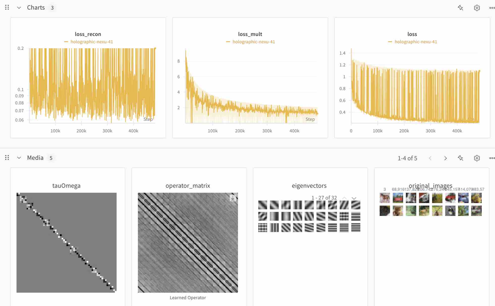

# Tiny Neural Isometries (PyTorch) [Unofficial]

Unofficial tiny PyTorch implementation of [Neural Isometries](https://github.com/vsitzmann/neural-isometries) with the toric Laplacian demo.

<p align="center">
  
</p>


## Setup
```bash
conda create -n niso python=3.10
conda activate niso
pip install -r requirements.txt
```

## Usage
```bash
python train.py
```

